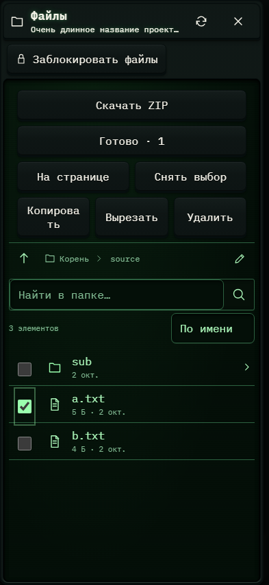

# 366. Файлы проекта

**Телефон · 393 × 852 · тема `crt-green`.**

Рабочие файлы проекта либо Git: дерево, выбранный файл и операции.

**Как открыть:** Кнопка папки или ветки Git в шапке.

**Снято после:** Выбрать: source/a.txt. Рабочее состояние.

**Действия:** «Обновить файлы»; «Закрыть файлы»; «Заблокировать файлы»; «Скачать ZIP»; «Готово · 1»; «Снять выбор»; «Копировать»; «Вырезать»; «Удалить»; «Папка выше»; «Корень проекта»; «source»; «Ввести путь»; «Найти файл»; дополнительные действия в прокручиваемой области.

**Поля и параметры:** «Найти в папке»; «Порядок файлов»; «Выбрать: source/sub»; «Выбрать: source/a.txt»; «Выбрать: source/b.txt».

**Для обсуждения:** Удобны ли выбор файла и навигация по папкам? Понятна ли блокировка редактирования и положение основных операций?

Снимок фиксирует вид интерфейса. Данные демонстрационные; ошибки, ожидания и конфликты могли быть созданы сценарием. Это не подтверждение состояния рабочего сервера или реальных интеграций.

**Источник:** [ProjectFiles.tsx](../../apps/web/src/ProjectFiles.tsx). Сценарий `file-batch`; код `56214b0`, 2026-10-02. Chromium; размер окна эмулируется, это не физический iPhone.

[Другой размер](366-desktop.md) · [Раздел](README.md) · [Весь каталог](../README.md)
