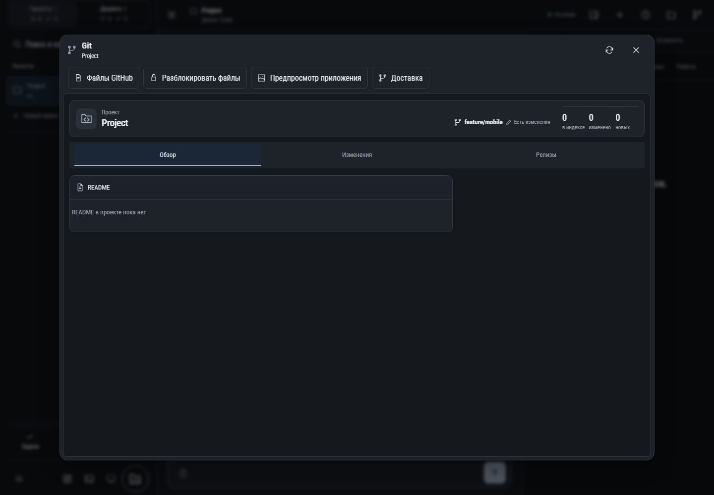

# 419. Git проекта

**Широкий экран · 1440 × 1000 · тема `classic-dark`.**

Рабочие файлы проекта либо Git: дерево, выбранный файл и операции.

**Как открыть:** Кнопка папки или ветки Git в шапке.

**Снято после:** Git проекта. Рабочее состояние.

**Действия:** «Обновить Git»; «Закрыть Git»; «Файлы GitHub»; «Разблокировать файлы»; «Предпросмотр приложения»; «Доставка»; «Обзор»; «Изменения»; «Релизы».

**Для обсуждения:** Удобны ли выбор файла и навигация по папкам? Понятна ли блокировка редактирования и положение основных операций?

Снимок фиксирует вид интерфейса. Данные демонстрационные; ошибки, ожидания и конфликты могли быть созданы сценарием. Это не подтверждение состояния рабочего сервера или реальных интеграций.

**Источник:** [ProjectFiles.tsx](../../apps/web/src/ProjectFiles.tsx). Сценарий `project-delivery`; код `56214b0`, 2026-10-02. Chromium; размер окна эмулируется, это не физический iPhone.

[Другой размер](419-phone.md) · [Раздел](README.md) · [Весь каталог](../README.md)
