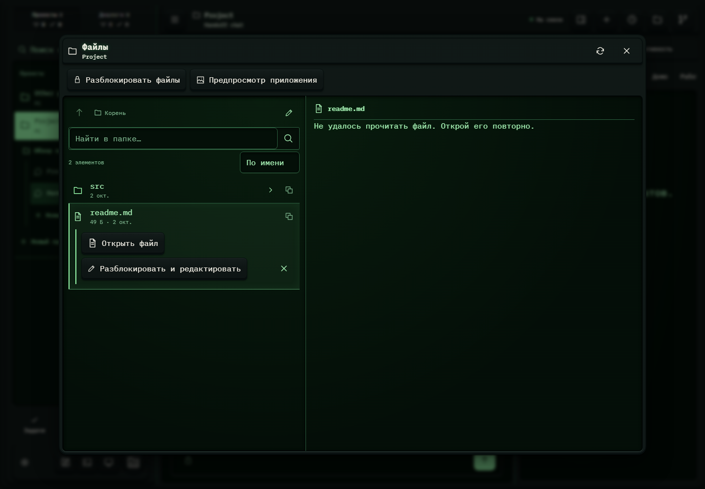

# 427. Файлы проекта

**Широкий экран · 1440 × 1000 · тема `crt-green`.**

Рабочие файлы проекта либо Git: дерево, выбранный файл и операции.

**Как открыть:** Кнопка папки или ветки Git в шапке.

**Снято после:** Открытое состояние. Рабочее состояние.

**Действия:** «Обновить файлы»; «Закрыть файлы»; «Разблокировать файлы»; «Предпросмотр приложения»; «Папка выше»; «Корень проекта»; «Ввести путь»; «Найти файл»; «src2 окт.»; «readme.md49 Б · 2 окт.»; «Открыть файл»; «Разблокировать и редактировать»; «Закрыть файл».

**Поля и параметры:** «Найти в папке»; «Порядок файлов».

**Для обсуждения:** Удобны ли выбор файла и навигация по папкам? Понятна ли блокировка редактирования и положение основных операций?

Снимок фиксирует вид интерфейса. Данные демонстрационные; ошибки, ожидания и конфликты могли быть созданы сценарием. Это не подтверждение состояния рабочего сервера или реальных интеграций.

**Источник:** [ProjectFiles.tsx](../../apps/web/src/ProjectFiles.tsx). Сценарий `project-inspector`; код `56214b0`, 2026-10-02. Chromium; размер окна эмулируется, это не физический iPhone.

[Другой размер](427-phone.md) · [Раздел](README.md) · [Весь каталог](../README.md)
