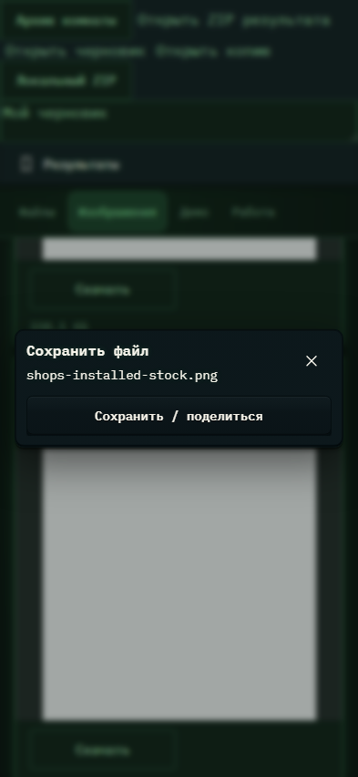

# 428. Сохранить файл

**Телефон · 393 × 852 · тема `crt-green`.**

Подготовка и сохранение файла или передача через системное меню.

**Как открыть:** Скачать / Сохранить у файла, результата или в просмотрщике.

**Снято после:** Открытое состояние. Рабочее состояние.

Компонент открыт в изолированном стенде. Демонстрационный фон и кнопки запуска вне окна не являются отдельным экраном продукта.

**Действия:** «Закрыть сохранение»; «Сохранить / поделиться».

**Для обсуждения:** Очевидно ли, почему иногда нужен второй тап? Сохраняется ли ощущение возврата в исходный экран?

Снимок фиксирует вид интерфейса. Данные демонстрационные; ошибки, ожидания и конфликты могли быть созданы сценарием. Это не подтверждение состояния рабочего сервера или реальных интеграций.

**Источник:** [DownloadLink.tsx](../../apps/web/src/DownloadLink.tsx). Сценарий `result-save`; код `56214b0`, 2026-10-02. Chromium; размер окна эмулируется, это не физический iPhone.

[Другой размер](428-desktop.md) · [Раздел](README.md) · [Весь каталог](../README.md)
