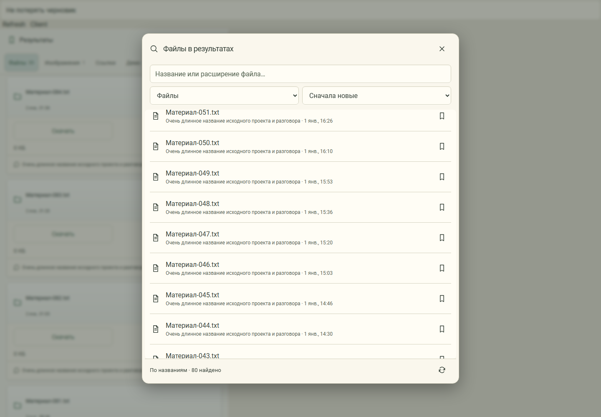

# 433. Поиск файлов в результатах

**Широкий экран · 1440 × 1000 · тема `organizer`.**

Поиск файлов в результатах с фильтрами и переходом к источнику.

**Как открыть:** Результаты → Найти файл в результатах.

**Снято после:** Показать ещё. Рабочее состояние.

**Действия:** «Закрыть поиск результатов»; «Открыть Материал-084.txt»; «В ленте: Материал-084.txt»; «Открыть Материал-083.txt»; «В ленте: Материал-083.txt»; «Открыть Материал-082.txt»; «В ленте: Материал-082.txt»; «Открыть Материал-081.txt»; «В ленте: Материал-081.txt»; «Открыть Материал-080.txt»; «В ленте: Материал-080.txt»; «Открыть Материал-079.txt»; «В ленте: Материал-079.txt»; «Открыть Материал-078.txt»; дополнительные действия в прокручиваемой области.

**Поля и параметры:** «Название файла»; «Тип результатов»; «Порядок результатов».

**Для обсуждения:** Достаточно ли информативны карточки и фильтры? Удобно ли различать одноимённые версии?

Снимок фиксирует вид интерфейса. Данные демонстрационные; ошибки, ожидания и конфликты могли быть созданы сценарием. Это не подтверждение состояния рабочего сервера или реальных интеграций.

**Источник:** [ResultSearch.tsx](../../apps/web/src/ResultSearch.tsx). Сценарий `result-search`; код `56214b0`, 2026-10-02. Chromium; размер окна эмулируется, это не физический iPhone.

[Другой размер](433-phone.md) · [Раздел](README.md) · [Весь каталог](../README.md)
