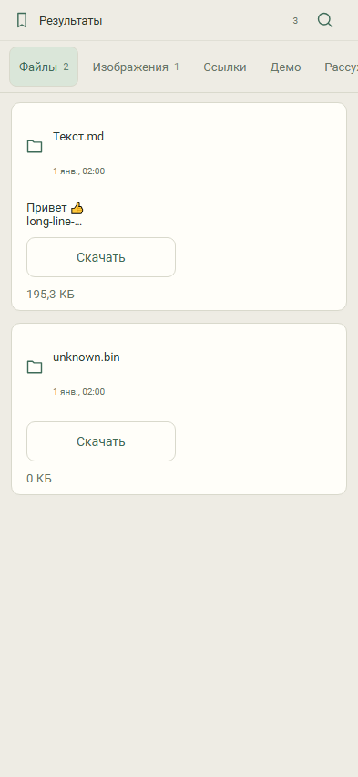

# 448. Текст.md

**Телефон · 393 × 852 · тема `по умолчанию`.**

Лента результатов работы с категориями файлов, изображений, ссылок и демо.

**Как открыть:** Нижняя вкладка Результаты.

**Снято после:** Открытие рабочего экрана. Рабочее состояние.

**Действия:** «Найти файл в результатах»; «Файлы2»; «Изображения1»; «Ссылки»; «Демо»; «Рассуждения»; «Открыть Текст.md»; «Открыть unknown.bin».

**Для обсуждения:** Легко ли найти нужный результат и его источник? Ясны ли просмотр, сохранение и передача?

Снимок фиксирует вид интерфейса. Данные демонстрационные; ошибки, ожидания и конфликты могли быть созданы сценарием. Это не подтверждение состояния рабочего сервера или реальных интеграций.

**Источник:** [Results.tsx](../../apps/web/src/Results.tsx). Сценарий `results-artifacts`; код `56214b0`, 2026-10-02. Chromium; размер окна эмулируется, это не физический iPhone.

[Другой размер](448-desktop.md) · [Раздел](README.md) · [Весь каталог](../README.md)
