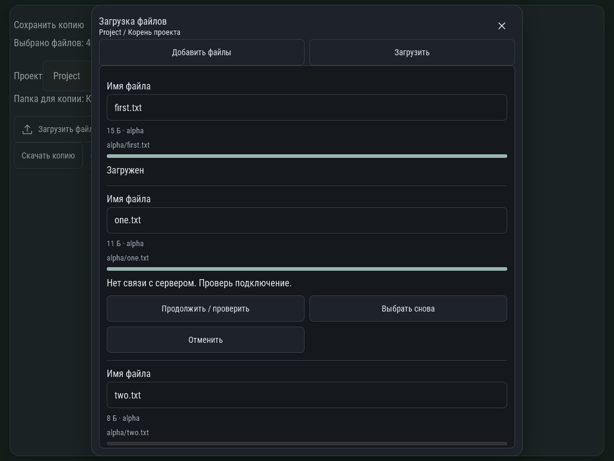

# ZIP: частичное завершение и восстановление

Общая очередь загрузки: first.txt завершён, one.txt записан, но ответ потерян;
ниже — существующий two.txt с выбором коллизии и three.txt с потерянным ответом
создания родительской папки. Очередь прокручивается внутри окна.

Проверка закрывает окно, заново открывает извлечение, восстанавливает прежние id,
сверяет реальное содержимое файлов и отсутствие повторного complete для one.txt.
Завершённый first.txt не отправляется снова. Снимок WebKit-фикстуры.
