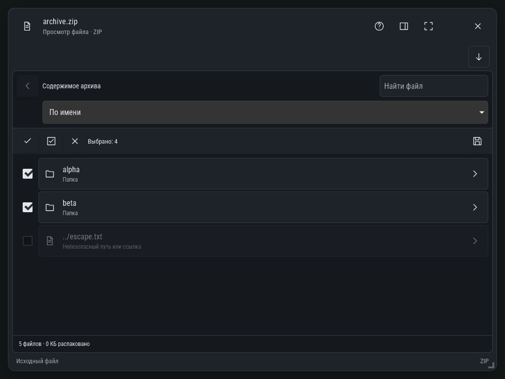

# ZIP: выбор нескольких файлов — classic-dark, 1024px

Общий просмотрщик с раскрытым выбором. Выбраны четыре файла в двух папках.
Отметка папки включает вложенные доступные файлы; небезопасная запись показана,
но её нельзя выбрать или извлечь. Панель содержит выбор, выбор найденных,
очистку, счётчик и извлечение. Поиск, сортировка и переходы сохранены.

Снимок автоматизированной WebKit-фикстуры, не физического устройства.
Состояния конфликта и обрыва проверены отдельно через реальный файловый API.
