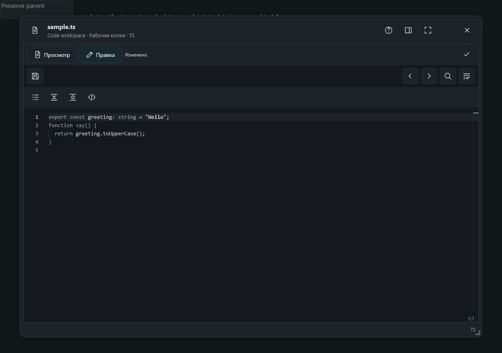

# Классическая тёмная тема

Monaco использует тёмную поверхность и текущие семантические цвета.

Снято 3 октября 2026 в Playwright WebKit на браузерной фикстуре настоящего общего редактора.
Файловый API подменён точными ответами; отдельные file-tools/manual-edit проверки используют действующий тестовый Hub.

