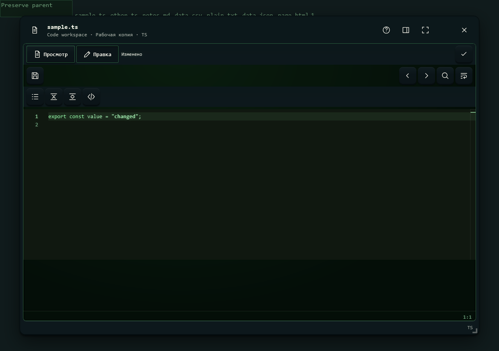

# CRT Green — код в общем корпусе

Monaco с номерами строк, подсветкой и общими инструментами. Цвета скобок и кода берутся из темы.

Снято 3 октября 2026 в Playwright WebKit на браузерной фикстуре настоящего общего редактора.
Файловый API подменён точными ответами; отдельные file-tools/manual-edit проверки используют действующий тестовый Hub.

