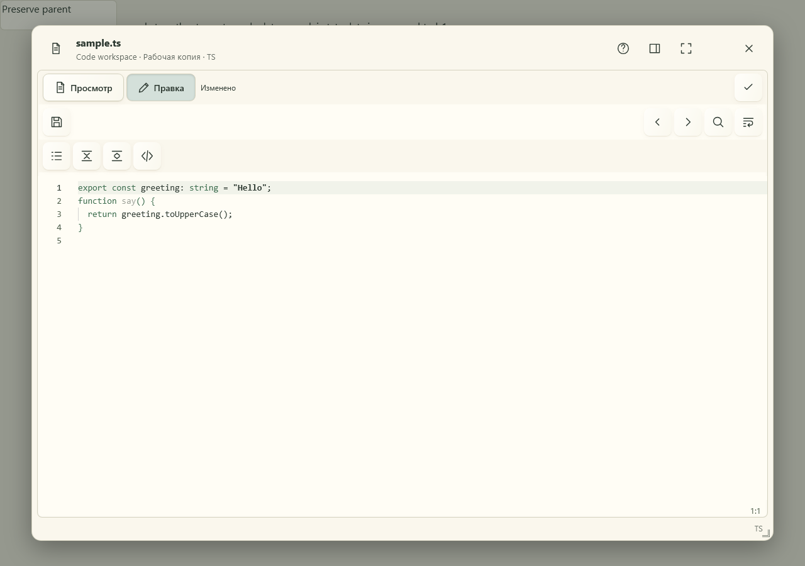

# Органайзер — редактор кода

Светлая бумажная рабочая область с сохранением общего окна.

Снято 3 октября 2026 в Playwright WebKit на браузерной фикстуре настоящего общего редактора.
Файловый API подменён точными ответами; отдельные file-tools/manual-edit проверки используют действующий тестовый Hub.

