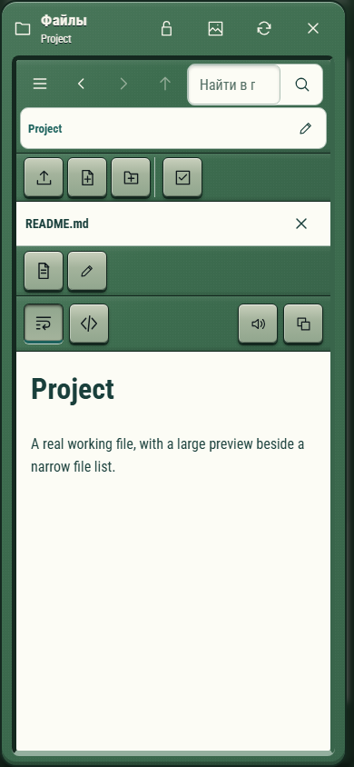

# Файлы — hitech-2000s, phone

Реальный интерфейс тестового проекта, 390×844, Chromium. Временные файлы и реальные файловые операции; текст предпросмотра в Windows-стенде подаётся из того же временного файла (Linux-путь скачивания в этой проверке не используется).

Замок и запуск приложения находятся в шапке. Под адресом — компактные команды загрузки, создания и выделения. На широком экране список узкий, предпросмотр получает больше места, перегородка изменяет ширину. На телефоне просмотр занимает область списка, крестик возвращает к файлам. Большой ряд подписанных кнопок убран. Общее устройство просмотрщика не перерабатывалось: это следующая отдельная тема после Git.

Снимок автоматизированный; физический iPad им не проверяется.
