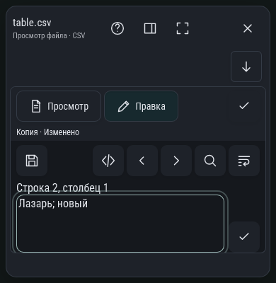

# CSV при ограниченной высоте

WebKit, 390×400 CSS px, эмуляция доступной высоты с клавиатурой. Во время ввода ячейки фильтр и строки временно уступают место полю; галочка возвращает таблицу. Изменение сразу принадлежит общему черновику. Это не физическая клавиатура iPad.

