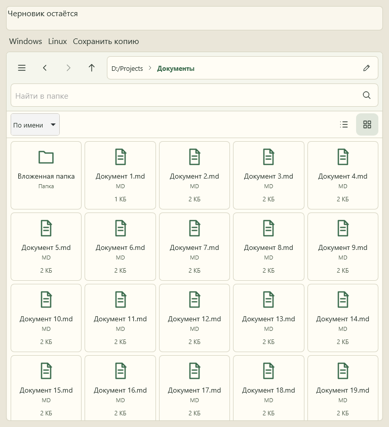

# icons-organizer

Режим значков общего FileBrowser в изолированной проверке компонентов; тестовые файлы. Поиск и история остаются теми же, что у списка.

Автоматический снимок WebKit, не физическая проверка устройства.
