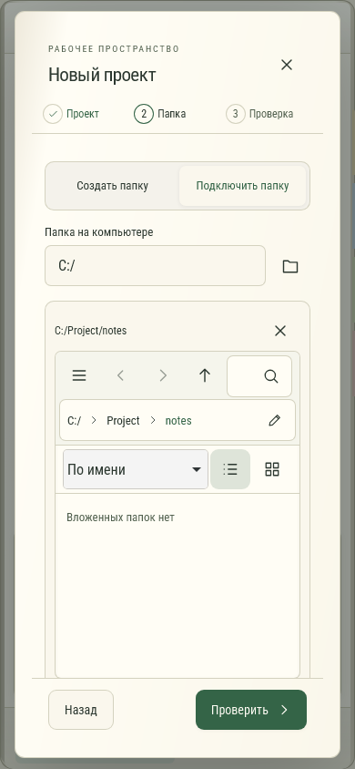

# project-folder

Выбор существующей папки проекта. Настоящее окно создания проекта, тестовый ответ источника папок. Переходы не создают проект; выбранная папка подставляется только кнопкой «Выбрать эту папку».

Автоматический снимок WebKit, не физическая проверка устройства.
