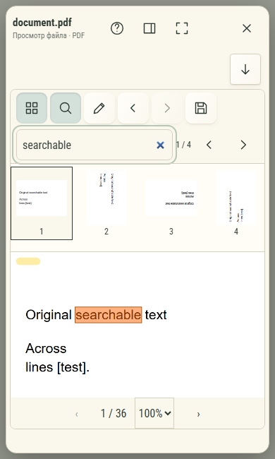

# PDF: поиск и страницы — organizer, 390px

Реальный универсальный просмотрщик в Chromium, браузерная фикстура. Не снимок
физического устройства. Открыт тестовый PDF из 36 страниц с разными поворотами и
CropBox, масштаб 100%. Запрос «searchable» найден на четырёх страницах. Текущее
совпадение подсвечено, миниатюры показывают исходные страницы. Жёлтая пометка —
несохранённая в исходник разметка: она пережила поиск и переходы по страницам.

Лупа и миниатюры стоят рядом с инструментами разметки, в общем корпусе. Поле поиска
и лента раскрываются по запросу. У оригинала сохраняются фиксированная геометрия,
текст и байты; PDF-копия с пометками сохраняется через обычный диалог.
