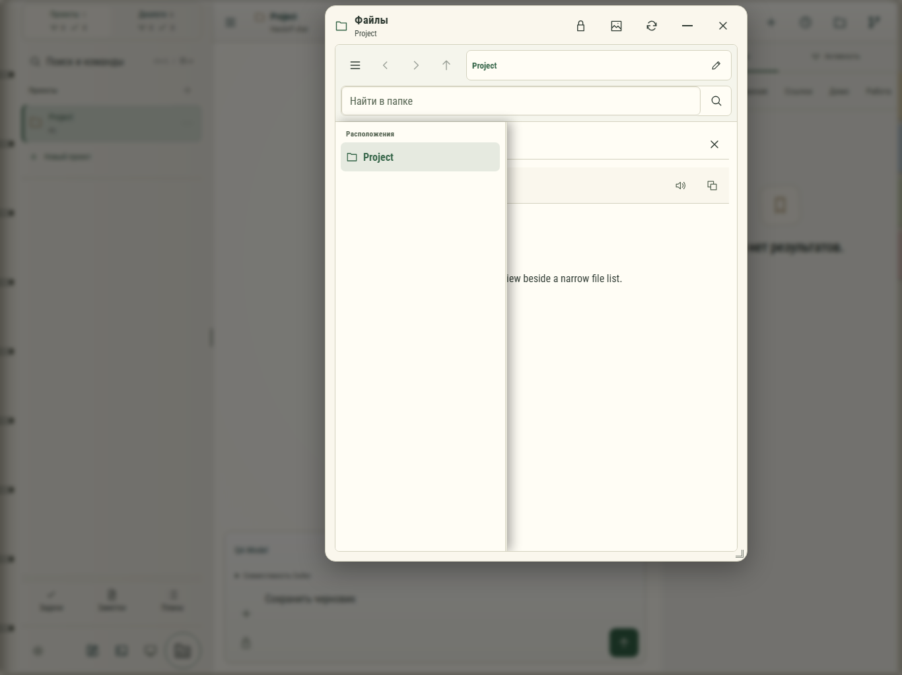

# organizer-1366

Общий ряд действий и инструментов текста: открыть, редактировать, сохранённая копия, перенос, исходник, озвучка, копирование. Темы и ширина указаны в имени. Настоящее приложение на изолированном тестовом Hub, локальный файл README.md; сохранённая копия задана фикстурой.

Браузерная проверка, не физическое устройство.
