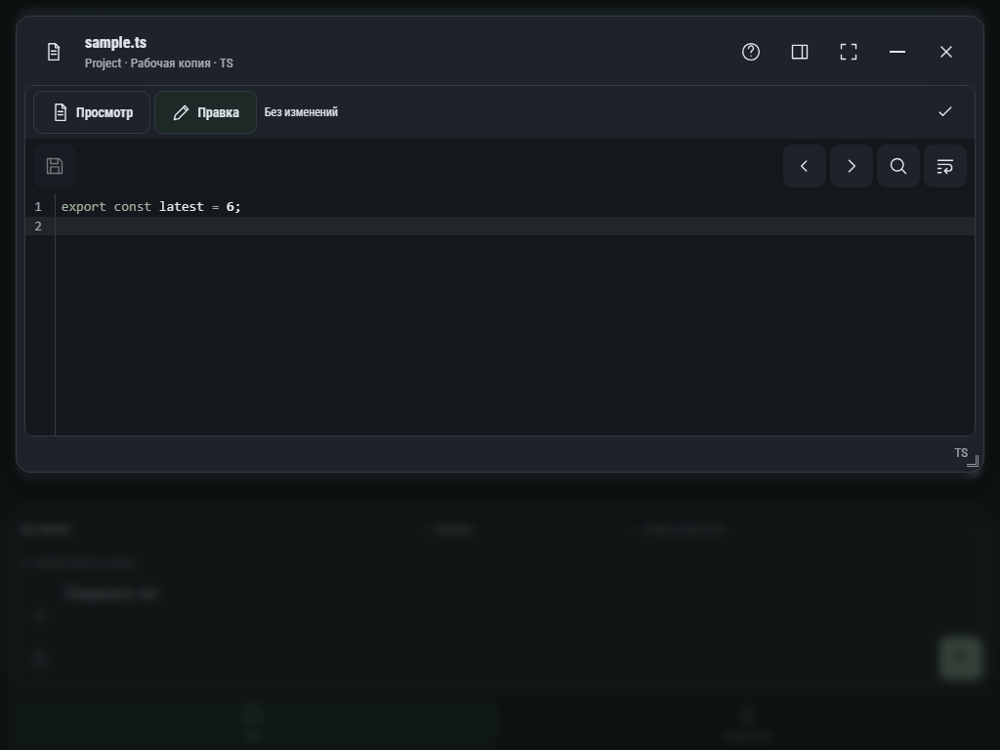

# Единое окно файла — Тёмная, 1024 px

Реализация, Chromium, тестовая рабочая копия sample.ts. Режим правки в общем корпусе, компактные действия, переключатель просмотра текущего черновика. Сохранение недоступно, пока изменений нет.

Окно сохраняет геометрию и поддерживает сворачивание в док.
