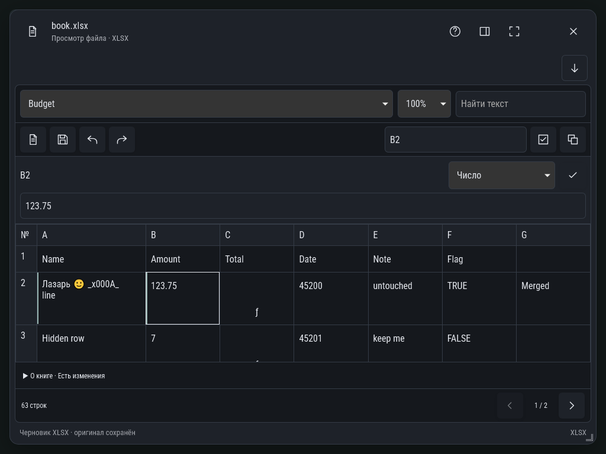

# XLSX — classic-dark, 1024 px

Правка числовой ячейки B2 в общем окне. Листы и поиск остаются в режиме просмотра; на узком экране при правке их скрывает контекстное поле. Диапазон, копирование, Undo/Redo и сохранение копии сгруппированы по назначению. Видимые формулы не пересчитываются. Фикстура содержит несколько листов, стили, диаграмму, защищённый лист и таблицу.

Браузерная фикстура Playwright WebKit, не физический iPad. Проверено 3 октября 2026.
