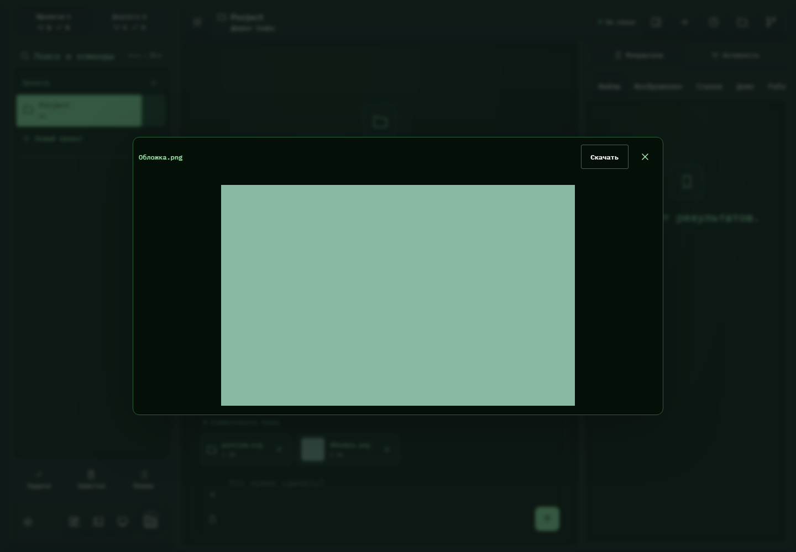

# 449. Вложенное изображение: Обложка.png

**Широкий экран · 1440 × 1000 · тема `crt-green`.**

Просмотр выбранного вложения перед отправкой.

**Как открыть:** Добавить файл в сообщение → нажать на вложение.

**Снято после:** Посмотреть Обложка.png. Рабочее состояние.

**Действия:** «Скачать»; «Закрыть изображение».

**Для обсуждения:** Ясно ли, что это ещё не отправленный файл? Удобны ли просмотр и удаление вложения на телефоне?

Снимок фиксирует вид интерфейса. Данные демонстрационные; ошибки, ожидания и конфликты могли быть созданы сценарием. Это не подтверждение состояния рабочего сервера или реальных интеграций.

**Источник:** [AttachmentPicker.tsx](../../apps/web/src/AttachmentPicker.tsx). Сценарий `polish-extra.mjs`; код `56214b0`, 2026-10-02. Chromium; размер окна эмулируется, это не физический iPhone.

[Другой размер](449-phone.md) · [Раздел](README.md) · [Весь каталог](../README.md)
