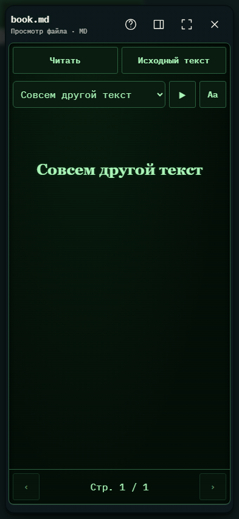

# 457. Просмотр: book.md

**Телефон · 393 × 852 · тема `crt-green`.**

Универсальный просмотр файла, форматные инструменты и действия с исходником.

**Как открыть:** Название файла/карточка результата → просмотр.

**Снято после:** Открыть файл. Рабочее состояние.

Компонент открыт в изолированном стенде. Демонстрационный фон и кнопки запуска вне окна не являются отдельным экраном продукта.

**Действия:** «Справка и клавиши»; «Свойства файла»; «Развернуть окно»; «Закрыть просмотр»; «Читать»; «Исходный текст»; «Озвучить страницу»; «Настройки чтения»; «Предыдущая страница»; «Следующая страница».

**Поля и параметры:** «Оглавление».

**Для обсуждения:** Достаточно ли пространства содержимому? Понятно ли различие чтения, редактирования, отправки и скачивания?

Снимок фиксирует вид интерфейса. Данные демонстрационные; ошибки, ожидания и конфликты могли быть созданы сценарием. Это не подтверждение состояния рабочего сервера или реальных интеграций.

**Источник:** [FileViewerDialog.tsx](../../apps/web/src/FileViewerDialog.tsx). Сценарий `book-reader`; код `56214b0`, 2026-10-02. Chromium; размер окна эмулируется, это не физический iPhone.

[Другой размер](457-desktop.md) · [Раздел](README.md) · [Весь каталог](../README.md)
