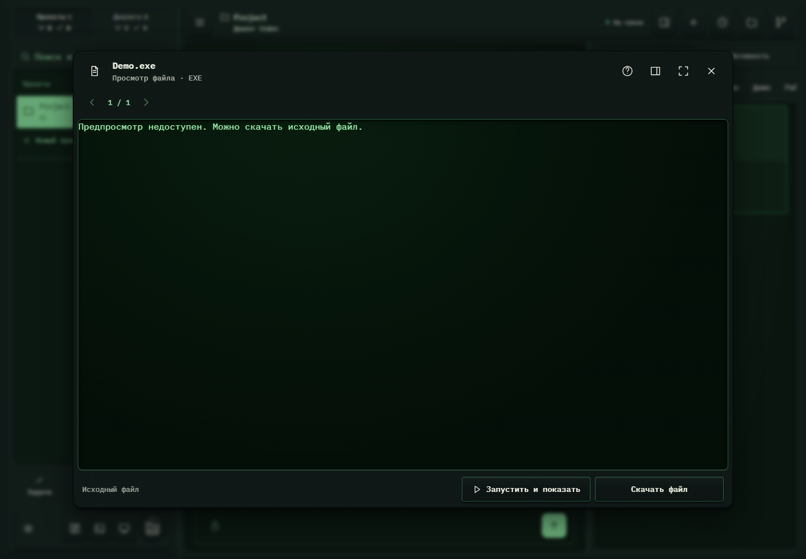

# 464. Просмотр: Demo.exe

**Широкий экран · 1440 × 1000 · тема `crt-green`.**

Универсальный просмотр файла, форматные инструменты и действия с исходником.

**Как открыть:** Название файла/карточка результата → просмотр.

**Снято после:** Открыть Demo.exe. Рабочее состояние.

**Действия:** «Справка и клавиши»; «Свойства файла»; «Развернуть окно»; «Закрыть просмотр»; «Предыдущий файл»; «Следующий файл»; «Запустить и показать».

**Для обсуждения:** Достаточно ли пространства содержимому? Понятно ли различие чтения, редактирования, отправки и скачивания?

Снимок фиксирует вид интерфейса. Данные демонстрационные; ошибки, ожидания и конфликты могли быть созданы сценарием. Это не подтверждение состояния рабочего сервера или реальных интеграций.

**Источник:** [FileViewerDialog.tsx](../../apps/web/src/FileViewerDialog.tsx). Сценарий `file-launch`; код `56214b0`, 2026-10-02. Chromium; размер окна эмулируется, это не физический iPhone.

[Другой размер](464-phone.md) · [Раздел](README.md) · [Весь каталог](../README.md)
