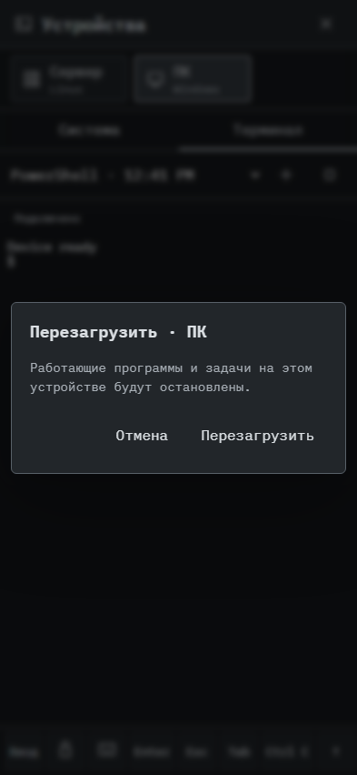

# 518. Действие устройства

**Телефон · 393 × 852 · тема `crt-green`.**

Подтверждение действия выбранного устройства.

**Как открыть:** Устройства → системное действие.

**Снято после:** Перезагрузка. Рабочее состояние.

Вложенное окно поверх сохранённого родительского экрана. Затемнение и видимые края родителя входят в снимок.

**Действия:** «Отмена»; «Перезагрузить».

**Для обсуждения:** Достаточно ли заметны целевое устройство и последствия?

Снимок фиксирует вид интерфейса. Данные демонстрационные; ошибки, ожидания и конфликты могли быть созданы сценарием. Это не подтверждение состояния рабочего сервера или реальных интеграций.

**Источник:** [DeviceWorkspace.tsx](../../apps/web/src/DeviceWorkspace.tsx). Сценарий `devices`; код `56214b0`, 2026-10-02. Chromium; размер окна эмулируется, это не физический iPhone.

[Другой размер](518-desktop.md) · [Раздел](README.md) · [Весь каталог](../README.md)
