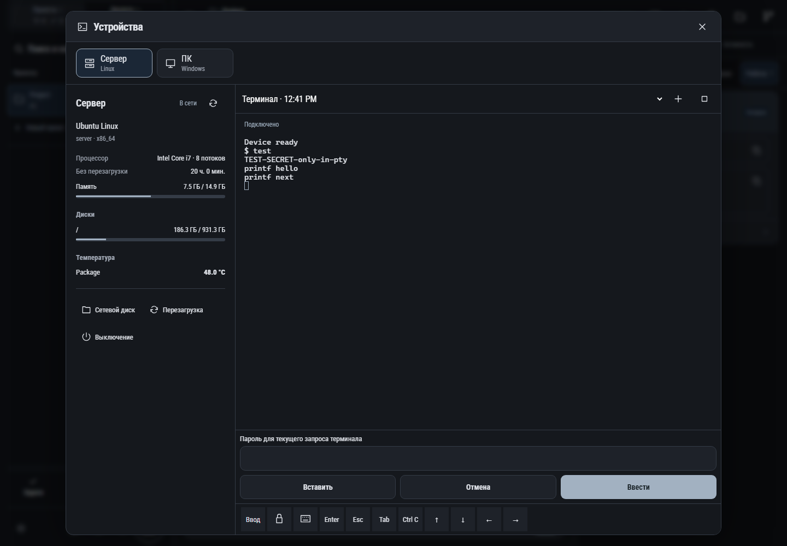

# 519. Устройства

**Широкий экран · 1440 × 1000 · тема `classic-dark`.**

Выбор устройства, информация о системе и приватный терминал.

**Как открыть:** Меню → Устройства; либо контекстная ссылка на терминал.

**Снято после:** Ввести пароль. Рабочее состояние.

**Действия:** «Закрыть устройства»; «СерверLinux»; «ПКWindows»; «Обновить устройство»; «Сетевой диск»; «Перезагрузка»; «Выключение»; «Новый терминал»; «Завершить терминал»; «Вставить»; «Отмена»; «Ввести»; «Ввести команду»; «Ввести пароль»; дополнительные действия в прокручиваемой области.

**Поля и параметры:** «Сессия терминала»; «Terminal input»; «Пароль терминала».

**Для обсуждения:** Понятно ли, на каком устройстве выполняются действия? Удобны ли ввод, вставка и переключение терминалов на телефоне?

Снимок фиксирует вид интерфейса. Данные демонстрационные; ошибки, ожидания и конфликты могли быть созданы сценарием. Это не подтверждение состояния рабочего сервера или реальных интеграций.

**Источник:** [DeviceWorkspace.tsx](../../apps/web/src/DeviceWorkspace.tsx). Сценарий `devices`; код `56214b0`, 2026-10-02. Chromium; размер окна эмулируется, это не физический iPhone.

[Другой размер](519-phone.md) · [Раздел](README.md) · [Весь каталог](../README.md)
