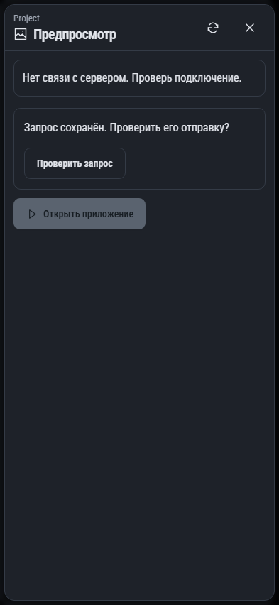

# 529. Предпросмотр приложения

**Телефон · 393 × 852 · тема `classic-dark`.**

Предпросмотр запущенного приложения и выбор цели/режима просмотра.

**Как открыть:** Обзор проекта → Предпросмотр приложения.

**Снято после:** Открыть приложение. Сообщение об ошибке или проверке.

Вложенное окно поверх сохранённого родительского экрана. Затемнение и видимые края родителя входят в снимок.

**Действия:** «Обновить предпросмотры»; «Закрыть предпросмотр»; «Проверить запрос»; «Открыть приложение».

**Для обсуждения:** Ясно ли, где работает приложение? Удобны ли размер, ввод и отделение предпросмотра от основного чата?

Снимок фиксирует вид интерфейса. Данные демонстрационные; ошибки, ожидания и конфликты могли быть созданы сценарием. Это не подтверждение состояния рабочего сервера или реальных интеграций.

**Источник:** [GuiPreviewPanel.tsx](../../apps/web/src/GuiPreviewPanel.tsx). Сценарий `gui-preview`; код `56214b0`, 2026-10-02. Chromium; размер окна эмулируется, это не физический iPhone.

[Другой размер](529-desktop.md) · [Раздел](README.md) · [Весь каталог](../README.md)
