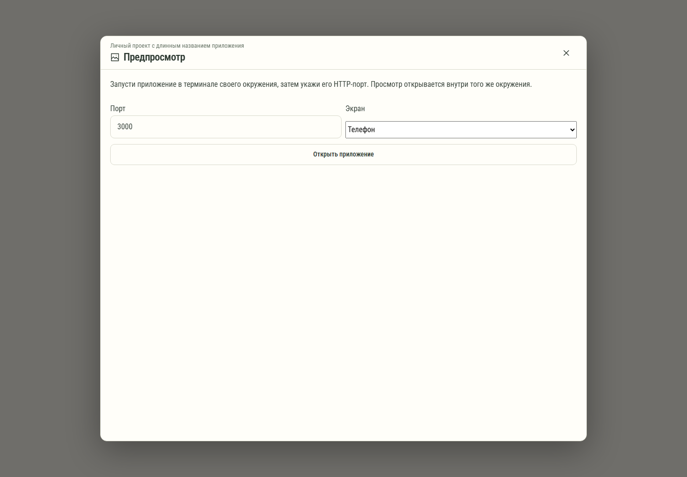

# 534. Предпросмотр приложения

**Широкий экран · 1440 × 1000 · тема `по умолчанию`.**

Предпросмотр запущенного приложения и выбор цели/режима просмотра.

**Как открыть:** Обзор проекта → Предпросмотр приложения.

**Снято после:** Открытие рабочего экрана. Рабочее состояние.

Компонент открыт в изолированном стенде. Демонстрационный фон и кнопки запуска вне окна не являются отдельным экраном продукта.

**Действия:** «Закрыть предпросмотр»; «Открыть приложение».

**Поля и параметры:** «Порт»; «ЭкранТелефонПланшетКомпьютер».

**Для обсуждения:** Ясно ли, где работает приложение? Удобны ли размер, ввод и отделение предпросмотра от основного чата?

Снимок фиксирует вид интерфейса. Данные демонстрационные; ошибки, ожидания и конфликты могли быть созданы сценарием. Это не подтверждение состояния рабочего сервера или реальных интеграций.

**Источник:** [GuiPreviewPanel.tsx](../../apps/web/src/GuiPreviewPanel.tsx). Сценарий `workspace-preview`; код `56214b0`, 2026-10-02. Chromium; размер окна эмулируется, это не физический iPhone.

[Другой размер](534-phone.md) · [Раздел](README.md) · [Весь каталог](../README.md)
