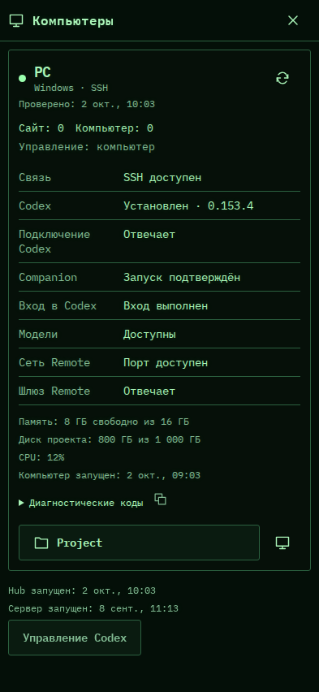

# 537. Компьютеры

**Телефон · 393 × 852 · тема `crt-green`.**

Состояние компьютеров, компонентов и доступных операций восстановления.

**Как открыть:** Настройки → Подключения → Компьютеры.

**Снято после:** Проверить PC. Рабочее состояние.

**Действия:** «Закрыть компьютеры»; «Проверить PC»; «Копировать диагностику»; «Project»; «Remote: Project»; «Управление Codex».

**Для обсуждения:** Можно ли быстро понять, что готово, что сломано и что требует участия? Не смешаны ли диагностика и ремонт?

Снимок фиксирует вид интерфейса. Данные демонстрационные; ошибки, ожидания и конфликты могли быть созданы сценарием. Это не подтверждение состояния рабочего сервера или реальных интеграций.

**Источник:** [MachineHealth.tsx](../../apps/web/src/MachineHealth.tsx). Сценарий `machine-health`; код `56214b0`, 2026-10-02. Chromium; размер окна эмулируется, это не физический iPhone.

[Другой размер](537-desktop.md) · [Раздел](README.md) · [Весь каталог](../README.md)
