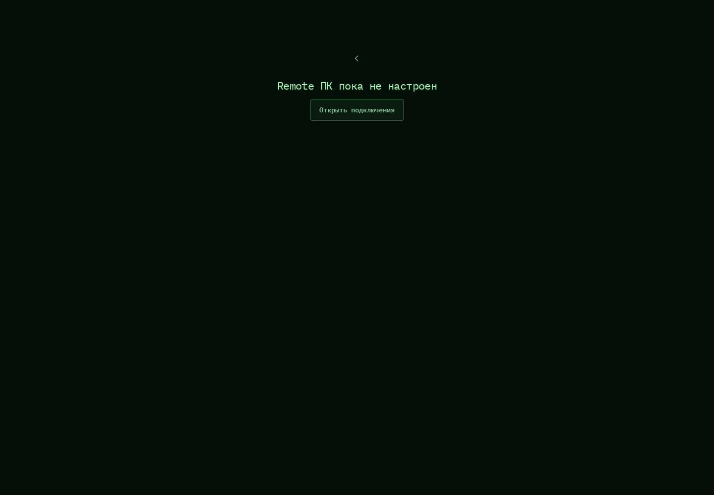

# 541. Remote ПК

**Широкий экран · 1440 × 1000 · тема `crt-green`.**

Удалённый экран выбранного компьютера или запущенного файла.

**Как открыть:** Меню → Remote; либо запуск файла → Remote.

**Снято после:** Открыть Remote. Рабочее состояние.

**Действия:** «Назад к чату»; «Открыть подключения».

**Для обсуждения:** Хватает ли экрану места на телефоне? Понятны ли ввод, масштаб и возврат?

Снимок фиксирует вид интерфейса. Данные демонстрационные; ошибки, ожидания и конфликты могли быть созданы сценарием. Это не подтверждение состояния рабочего сервера или реальных интеграций.

**Источник:** [PcRemote.tsx](../../apps/web/src/PcRemote.tsx), [FileLaunchPanel.tsx](../../apps/web/src/FileLaunchPanel.tsx). Сценарий `shared-settings-remote`; код `56214b0`, 2026-10-02. Chromium; размер окна эмулируется, это не физический iPhone.

[Другой размер](541-phone.md) · [Раздел](README.md) · [Весь каталог](../README.md)
