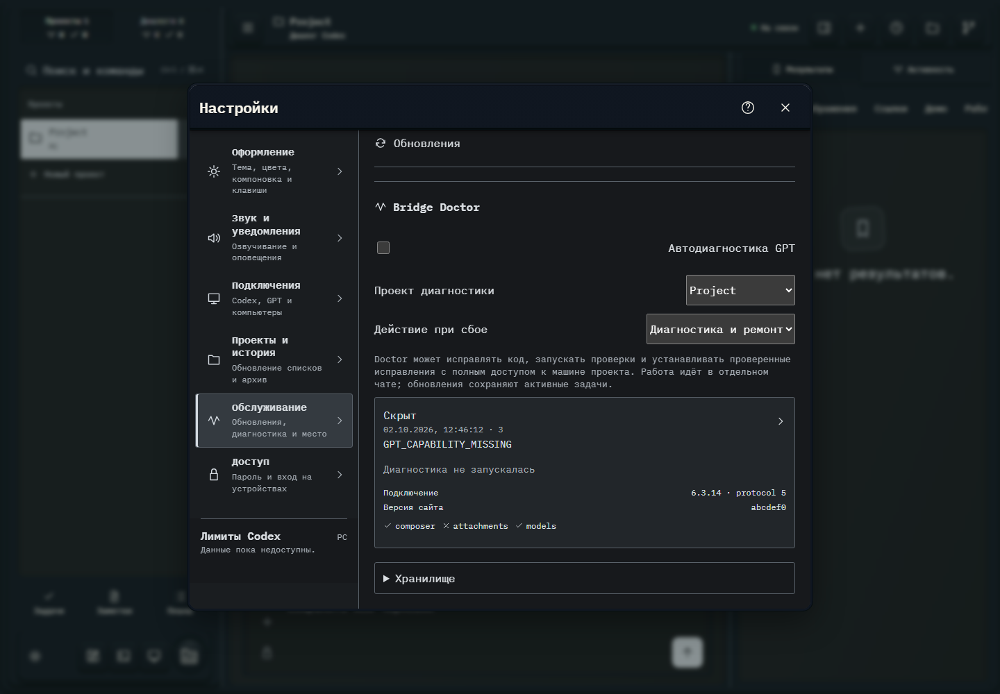

# 545. Настройки

**Широкий экран · 1440 × 1000 · тема `crt-green`.**

Общие настройки оформления, звука, подключений, истории, обслуживания и доступа.

**Как открыть:** Меню → Настройки → категория.

**Снято после:** Скрыть. Рабочее состояние.

**Действия:** «Все категории настроек»; «Справка и клавиши»; «Закрыть настройки»; «Проверить копии на компьютере».

**Поля и параметры:** «Автодиагностика GPT»; «Проект Bridge Doctor»; «Режим Bridge Doctor».

**Для обсуждения:** Соответствует ли группировка ожиданиям? Видно ли различие общих и относящихся к этому устройству настроек?

Снимок фиксирует вид интерфейса. Данные демонстрационные; ошибки, ожидания и конфликты могли быть созданы сценарием. Это не подтверждение состояния рабочего сервера или реальных интеграций.

**Источник:** [WorkspaceSettings.tsx](../../apps/web/src/WorkspaceSettings.tsx), [SettingsSections.tsx](../../apps/web/src/SettingsSections.tsx). Сценарий `bridge-doctor`; код `56214b0`, 2026-10-02. Chromium; размер окна эмулируется, это не физический iPhone.

[Другой размер](545-phone.md) · [Раздел](README.md) · [Весь каталог](../README.md)
