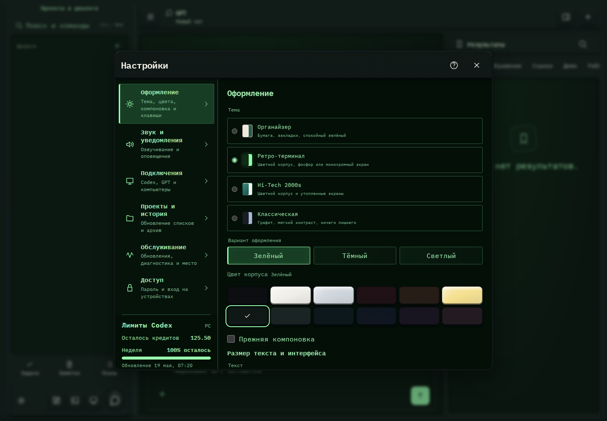

# 574. Настройки

**Широкий экран · 1440 × 1000 · тема `crt-green`.**

Общие настройки оформления, звука, подключений, истории, обслуживания и доступа.

**Как открыть:** Меню → Настройки → категория.

**Снято после:** Настройки. Рабочее состояние.

**Действия:** «Справка и клавиши»; «Закрыть настройки»; «ОформлениеТема, цвета, компоновка и клавиши»; «Звук и уведомленияОзвучивание и оповещения»; «ПодключенияCodex, GPT и компьютеры»; «Проекты и историяОбновление списков и архив»; «ОбслуживаниеОбновления, диагностика и место»; «ДоступПароль и вход на устройствах»; «Активировать»; «Зелёный»; «Тёмный»; «Светлый»; «Чёрный»; «Белый»; дополнительные действия в прокручиваемой области.

**Поля и параметры:** «ОрганайзерБумага, закладки, спокойный зелёный»; «Ретро-терминалЦветной корпус, фосфор или монохромный экран»; «Hi-Tech 2000sЦветной корпус и утопленные экраны»; «КлассическаяГрафит, мягкий контраст, ничего лишнего»; «Прежняя компоновка».

**Для обсуждения:** Соответствует ли группировка ожиданиям? Видно ли различие общих и относящихся к этому устройству настроек?

Снимок фиксирует вид интерфейса. Данные демонстрационные; ошибки, ожидания и конфликты могли быть созданы сценарием. Это не подтверждение состояния рабочего сервера или реальных интеграций.

**Источник:** [WorkspaceSettings.tsx](../../apps/web/src/WorkspaceSettings.tsx), [SettingsSections.tsx](../../apps/web/src/SettingsSections.tsx). Сценарий `shared-settings-remote`; код `56214b0`, 2026-10-02. Chromium; размер окна эмулируется, это не физический iPhone.

[Другой размер](574-phone.md) · [Раздел](README.md) · [Весь каталог](../README.md)
