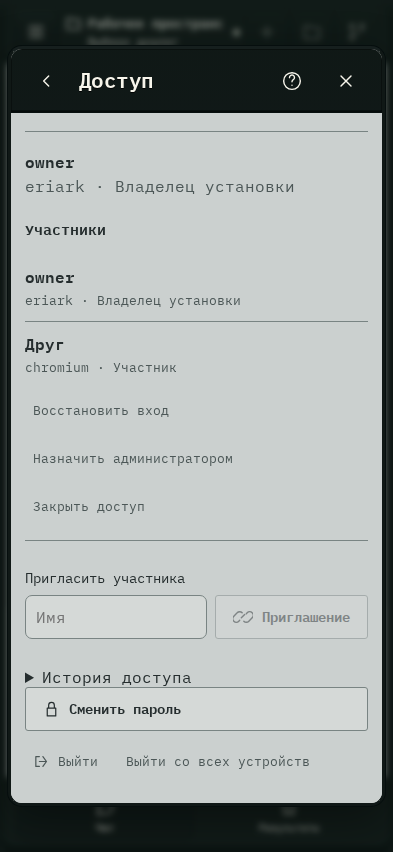

# 589. Настройки

**Телефон · 393 × 852 · тема `crt-green`.**

Общие настройки оформления, звука, подключений, истории, обслуживания и доступа.

**Как открыть:** Меню → Настройки → категория.

**Снято после:** Подтвердить. Действие с подтверждением.

**Действия:** «Справка и клавиши»; «Закрыть настройки»; «ОформлениеТема, цвета, компоновка и клавиши»; «Звук и уведомленияОзвучивание и оповещения»; «ПодключенияCodex, GPT и компьютеры»; «Проекты и историяОбновление списков и архив»; «ОбслуживаниеОбновления, диагностика и место»; «ДоступПароль и вход на устройствах»; «Восстановить вход»; «Назначить администратором»; «Закрыть доступ»; «Приглашение»; «Сменить пароль»; «Выйти»; дополнительные действия в прокручиваемой области.

**Поля и параметры:** «Имя».

**Для обсуждения:** Соответствует ли группировка ожиданиям? Видно ли различие общих и относящихся к этому устройству настроек?

Снимок фиксирует вид интерфейса. Данные демонстрационные; ошибки, ожидания и конфликты могли быть созданы сценарием. Это не подтверждение состояния рабочего сервера или реальных интеграций.

**Источник:** [WorkspaceSettings.tsx](../../apps/web/src/WorkspaceSettings.tsx), [SettingsSections.tsx](../../apps/web/src/SettingsSections.tsx). Сценарий `team-offboarding`; код `56214b0`, 2026-10-02. Chromium; размер окна эмулируется, это не физический iPhone.

[Другой размер](589-desktop.md) · [Раздел](README.md) · [Весь каталог](../README.md)
