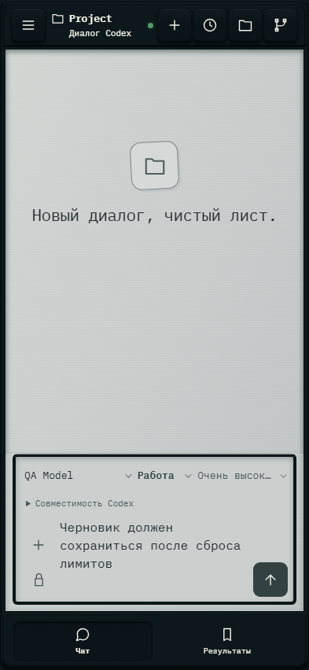

# 614. Новый диалог, чистый лист.

**Телефон · 393 × 852 · тема `crt-green`.**

Состояние системы, использование ресурсов и уведомления.

**Как открыть:** Шапка, уведомления либо соответствующий раздел настроек.

**Снято после:** Закрыть настройки. Рабочее состояние.

**Действия:** «Добавить файлы или изображения»; «Отправить сообщение».

**Поля и параметры:** «Модель Codex»; «Режим Codex»; «Уровень размышления»; «Доступ Codex»; «Сообщение Codex».

**Для обсуждения:** Достаточно ли спокойна и понятна индикация? Видно ли, требуется ли действие пользователя?

Снимок фиксирует вид интерфейса. Данные демонстрационные; ошибки, ожидания и конфликты могли быть созданы сценарием. Это не подтверждение состояния рабочего сервера или реальных интеграций.

**Источник:** [App.tsx](../../apps/web/src/App.tsx), [WorkspaceSettings.tsx](../../apps/web/src/WorkspaceSettings.tsx). Сценарий `usage-resets`; код `56214b0`, 2026-10-02. Chromium; размер окна эмулируется, это не физический iPhone.

[Другой размер](614-desktop.md) · [Раздел](README.md) · [Весь каталог](../README.md)
