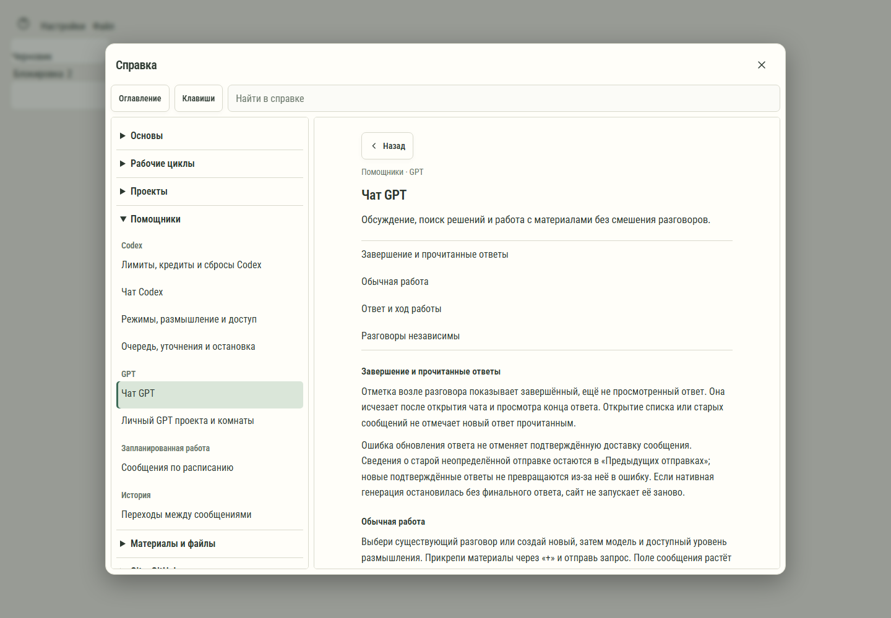

# 615. Справка и клавиши

**Широкий экран · 1440 × 1000 · тема `по умолчанию`.**

Полная справка с поиском, категориями, статьями и клавишами.

**Как открыть:** Кнопка ? в настройках или тематическом окне.

**Снято после:** Сообщение. Сообщение об ошибке или проверке.

**Действия:** «Закрыть справку»; «Оглавление справки»; «Клавиши»; «Назад»; «Завершение и прочитанные ответы»; «Обычная работа»; «Ответ и ход работы»; «Разговоры независимы»; «Личный GPT проекта и комнаты»; «GPT или Codex не отвечает»; «Результаты и связь с сообщениями»; «Исследование с GPT и передача результата».

**Поля и параметры:** «Поиск по справке».

**Для обсуждения:** Можно ли быстро найти ответ по своей задаче? Удобно ли возвращаться к исходному окну после статьи?

Снимок фиксирует вид интерфейса. Данные демонстрационные; ошибки, ожидания и конфликты могли быть созданы сценарием. Это не подтверждение состояния рабочего сервера или реальных интеграций.

**Источник:** [HelpGuide.tsx](../../apps/web/src/HelpGuide.tsx). Сценарий `workspace-help`; код `56214b0`, 2026-10-02. Chromium; размер окна эмулируется, это не физический iPhone.

[Другой размер](615-phone.md) · [Раздел](README.md) · [Весь каталог](../README.md)
