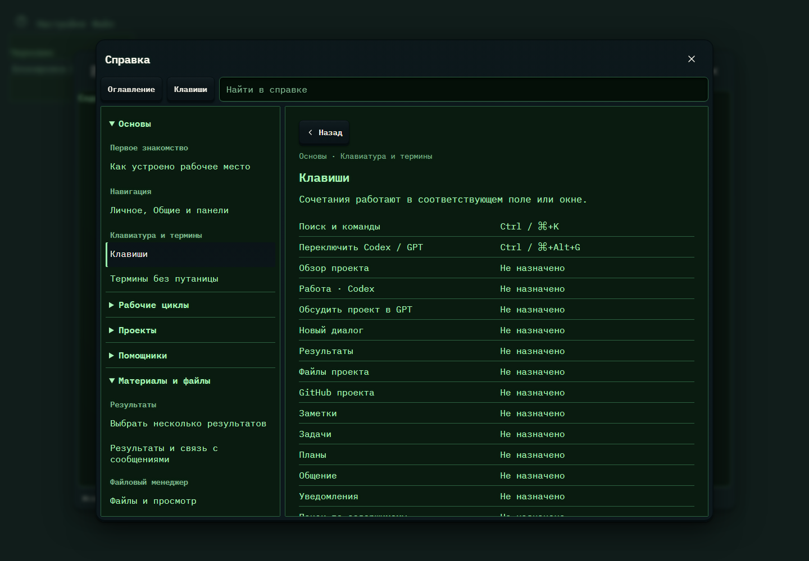

# 616. Справка и клавиши

**Широкий экран · 1440 × 1000 · тема `crt-green`.**

Полная справка с поиском, категориями, статьями и клавишами.

**Как открыть:** Кнопка ? в настройках или тематическом окне.

**Снято после:** Открытое состояние. Рабочее состояние.

Вложенное окно поверх сохранённого родительского экрана. Затемнение и видимые края родителя входят в снимок.

**Действия:** «Закрыть справку»; «Оглавление справки»; «Клавиши»; «Как устроено рабочее место»; «Личное, Общие и панели»; «Термины без путаницы»; «От задачи до готового изменения»; «Правка файла и перенос материалов»; «От брейншторма до проекта»; «Подключить участника и работать вместе»; «Исследование с GPT и передача результата»; «Небольшая правка прямо в GitHub»; «Создать или подключить проект»; «Профиль поведения проекта»; дополнительные действия в прокручиваемой области.

**Поля и параметры:** «Поиск по справке».

**Для обсуждения:** Можно ли быстро найти ответ по своей задаче? Удобно ли возвращаться к исходному окну после статьи?

Снимок фиксирует вид интерфейса. Данные демонстрационные; ошибки, ожидания и конфликты могли быть созданы сценарием. Это не подтверждение состояния рабочего сервера или реальных интеграций.

**Источник:** [HelpGuide.tsx](../../apps/web/src/HelpGuide.tsx). Сценарий `workspace-help`; код `56214b0`, 2026-10-02. Chromium; размер окна эмулируется, это не физический iPhone.

[Другой размер](616-phone.md) · [Раздел](README.md) · [Весь каталог](../README.md)
