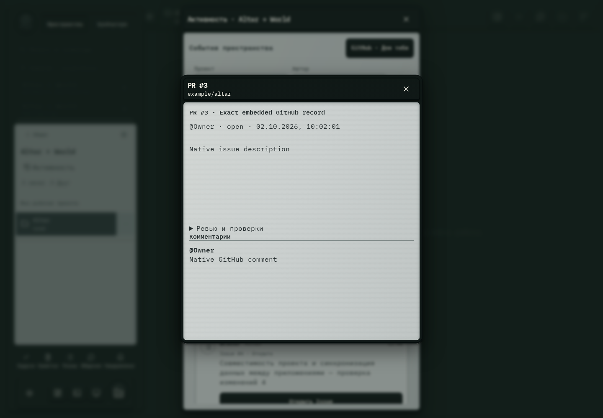

# 621. Общее пространство

**Широкий экран · 1440 × 1000 · тема `crt-green`.**

Лента активности пространства или GitHub, фильтры и обсуждение событий.

**Как открыть:** Общее пространство → Активность.

**Снято после:** Открыть PR. Рабочее состояние.

Вложенное окно поверх сохранённого родительского экрана. Затемнение и видимые края родителя входят в снимок.

**Действия:** «Закрыть пространство»; «GitHub · Для тебя»; «Обновить активность»; «1111111Add location lookup API»; «2222222Preserve nullable fields in old saves»; «3333333Test shared world contracts»; «Обсудить в GPT»; «Изучить в Codex»; «Нравится»; «Смотрю»; «Спасибо»; «Есть вопрос»; «Обсуждение»; «Открыть PR»; дополнительные действия в прокручиваемой области.

**Поля и параметры:** «Проект активности»; «Автор активности»; «Коммит для обсуждения».

**Для обсуждения:** Не перегружена ли лента служебными событиями? Понятны ли непрочитанные отметки и контекст обсуждений?

Снимок фиксирует вид интерфейса. Данные демонстрационные; ошибки, ожидания и конфликты могли быть созданы сценарием. Это не подтверждение состояния рабочего сервера или реальных интеграций.

**Источник:** [CollaborationSpaces.tsx](../../apps/web/src/CollaborationSpaces.tsx), [GitHubAttention.tsx](../../apps/web/src/GitHubAttention.tsx). Сценарий `space-activity`; код `56214b0`, 2026-10-02. Chromium; размер окна эмулируется, это не физический iPhone.

[Другой размер](621-phone.md) · [Раздел](README.md) · [Весь каталог](../README.md)
