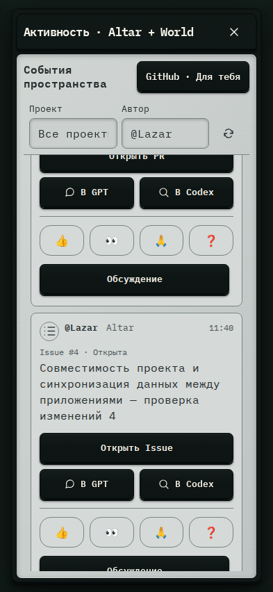

# 622. Общее пространство

**Телефон · 393 × 852 · тема `crt-green`.**

Лента активности пространства или GitHub, фильтры и обсуждение событий.

**Как открыть:** Общее пространство → Активность.

**Снято после:** Обновить активность. Рабочее состояние.

Вложенное окно поверх сохранённого родительского экрана. Затемнение и видимые края родителя входят в снимок.

**Действия:** «Закрыть пространство»; «GitHub · Для тебя»; «Обновить активность»; «Открыть PR»; «Обсудить в GPT»; «Изучить в Codex»; «Нравится»; «Смотрю»; «Спасибо»; «Есть вопрос»; «Обсуждение»; «Открыть Issue».

**Поля и параметры:** «Проект активности»; «Автор активности».

**Для обсуждения:** Не перегружена ли лента служебными событиями? Понятны ли непрочитанные отметки и контекст обсуждений?

Снимок фиксирует вид интерфейса. Данные демонстрационные; ошибки, ожидания и конфликты могли быть созданы сценарием. Это не подтверждение состояния рабочего сервера или реальных интеграций.

**Источник:** [CollaborationSpaces.tsx](../../apps/web/src/CollaborationSpaces.tsx), [GitHubAttention.tsx](../../apps/web/src/GitHubAttention.tsx). Сценарий `space-activity`; код `56214b0`, 2026-10-02. Chromium; размер окна эмулируется, это не физический iPhone.

[Другой размер](622-desktop.md) · [Раздел](README.md) · [Весь каталог](../README.md)
