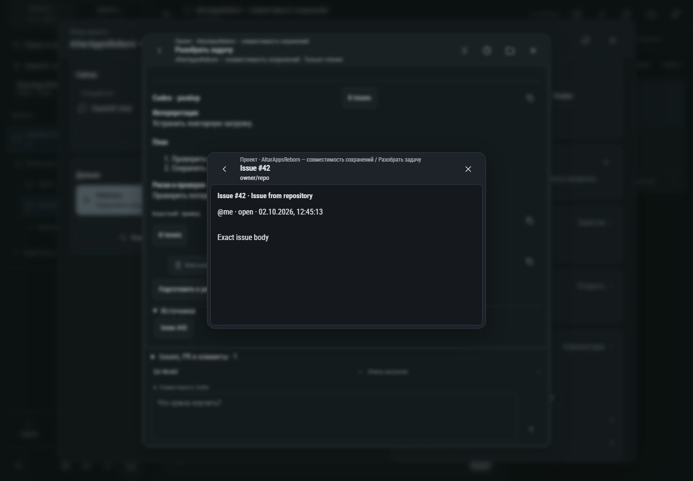

# 630. GitHub · событие

**Широкий экран · 1440 × 1000 · тема `classic-dark`.**

Просмотр исходного события GitHub: Issue, PR, коммит или проверка.

**Как открыть:** Активность пространства → карточка источника.

**Снято после:** Issue #42. Рабочее состояние.

Вложенное окно поверх сохранённого родительского экрана. Затемнение и видимые края родителя входят в снимок.

**Действия:** «Назад: Разобрать задачу»; «Закрыть событие».

**Для обсуждения:** Достаточно ли контекста для действия без перехода на внешний сайт? Хорошо ли читаются длинные изменения?

Снимок фиксирует вид интерфейса. Данные демонстрационные; ошибки, ожидания и конфликты могли быть созданы сценарием. Это не подтверждение состояния рабочего сервера или реальных интеграций.

**Источник:** [ActivitySourceWindow.tsx](../../apps/web/src/ActivitySourceWindow.tsx). Сценарий `intake`; код `56214b0`, 2026-10-02. Chromium; размер окна эмулируется, это не физический iPhone.

[Другой размер](630-phone.md) · [Раздел](README.md) · [Весь каталог](../README.md)
