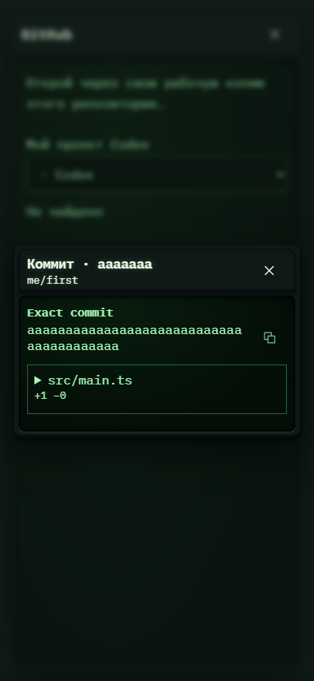

# 631. GitHub · событие

**Телефон · 393 × 852 · тема `crt-green`.**

Просмотр исходного события GitHub: Issue, PR, коммит или проверка.

**Как открыть:** Активность пространства → карточка источника.

**Снято после:** Коммит. Рабочее состояние.

Вложенное окно поверх сохранённого родительского экрана. Затемнение и видимые края родителя входят в снимок.

**Действия:** «Закрыть событие»; «Скопировать SHA»; «Скопировать изменения».

**Для обсуждения:** Достаточно ли контекста для действия без перехода на внешний сайт? Хорошо ли читаются длинные изменения?

Снимок фиксирует вид интерфейса. Данные демонстрационные; ошибки, ожидания и конфликты могли быть созданы сценарием. Это не подтверждение состояния рабочего сервера или реальных интеграций.

**Источник:** [ActivitySourceWindow.tsx](../../apps/web/src/ActivitySourceWindow.tsx). Сценарий `project-entry`; код `56214b0`, 2026-10-02. Chromium; размер окна эмулируется, это не физический iPhone.

[Другой размер](631-desktop.md) · [Раздел](README.md) · [Весь каталог](../README.md)
