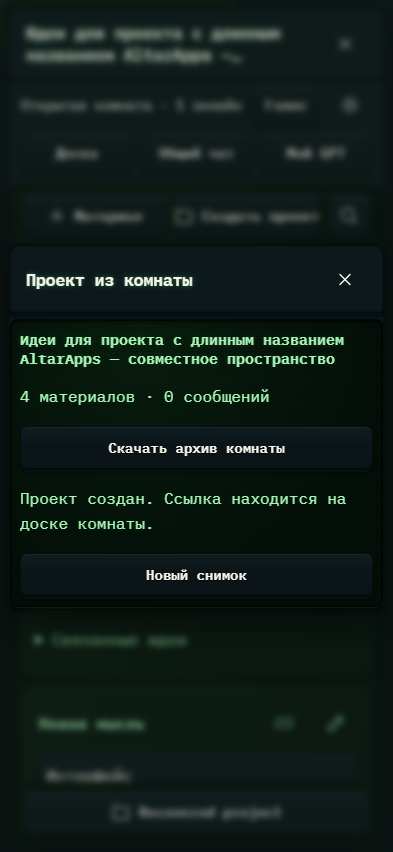

# 639. Проект из комнаты

**Телефон · 393 × 852 · тема `crt-green`.**

Совместная комната обсуждения с материалами, GPT и голосовыми возможностями.

**Как открыть:** Общие пространства → Брейншторм → комната.

**Снято после:** Открыть проект. Рабочее состояние.

Вложенное окно поверх сохранённого родительского экрана. Затемнение и видимые края родителя входят в снимок.

Компонент открыт в изолированном стенде. Демонстрационный фон и кнопки запуска вне окна не являются отдельным экраном продукта.

**Действия:** «Закрыть»; «Новый снимок».

**Для обсуждения:** Не конкурируют ли чат, материалы и управление комнатой? Что должно быть видно первым на телефоне?

Снимок фиксирует вид интерфейса. Данные демонстрационные; ошибки, ожидания и конфликты могли быть созданы сценарием. Это не подтверждение состояния рабочего сервера или реальных интеграций.

**Источник:** [Brainstorm.tsx](../../apps/web/src/Brainstorm.tsx). Сценарий `brainstorm`; код `56214b0`, 2026-10-02. Chromium; размер окна эмулируется, это не физический iPhone.

[Другой размер](639-desktop.md) · [Раздел](README.md) · [Весь каталог](../README.md)
