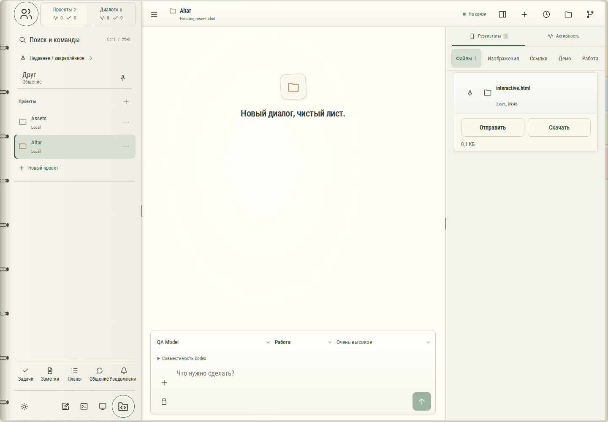

# 640. interactive.html

**Широкий экран · 1440 × 1000 · тема `organizer`.**

Совместная работа: люди, сообщения, материалы и события.

**Как открыть:** Общие пространства либо Общение.

**Снято после:** Результаты. Рабочее состояние.

**Действия:** «Найти файл в результатах»; «Файлы1»; «Изображения»; «Ссылки»; «Демо»; «Работа»; «Сохранить ссылку: interactive.html»; «Открыть interactive.html»; «Отправить».

**Для обсуждения:** Понятны ли адресат, область доступа и связь с исходным материалом?

Снимок фиксирует вид интерфейса. Данные демонстрационные; ошибки, ожидания и конфликты могли быть созданы сценарием. Это не подтверждение состояния рабочего сервера или реальных интеграций.

**Источник:** [Communication.tsx](../../apps/web/src/Communication.tsx), [CollaborationSpaces.tsx](../../apps/web/src/CollaborationSpaces.tsx). Сценарий `communication`; код `56214b0`, 2026-10-02. Chromium; размер окна эмулируется, это не физический iPhone.

[Другой размер](640-phone.md) · [Раздел](README.md) · [Весь каталог](../README.md)
