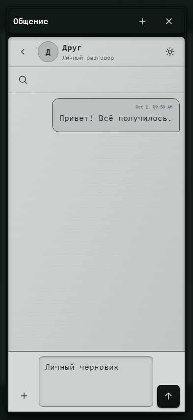

# 653. Общение

**Телефон · 393 × 852 · тема `crt-green`.**

Личные и групповые разговоры с участниками рабочего пространства.

**Как открыть:** Меню → Общение.

**Снято после:** Друг. Рабочее состояние.

Вложенное окно поверх сохранённого родительского экрана. Затемнение и видимые края родителя входят в снимок.

**Действия:** «Создать группу»; «Закрыть общение»; «Чаты»; «Люди»; «Дизайн и разработка очень интересного общего проекта»; «Друг»; «Настройки разговора»; «Поиск по переписке»; «Добавить к сообщению»; «Отправить в общий чат».

**Поля и параметры:** «Найти чат»; «Сообщение участникам».

**Для обсуждения:** Есть ли привычное ощущение мессенджера? Ясны ли непрочитанные сообщения, вложения и возврат к списку?

Снимок фиксирует вид интерфейса. Данные демонстрационные; ошибки, ожидания и конфликты могли быть созданы сценарием. Это не подтверждение состояния рабочего сервера или реальных интеграций.

**Источник:** [Communication.tsx](../../apps/web/src/Communication.tsx). Сценарий `messenger`; код `56214b0`, 2026-10-02. Chromium; размер окна эмулируется, это не физический iPhone.

[Другой размер](653-desktop.md) · [Раздел](README.md) · [Весь каталог](../README.md)
