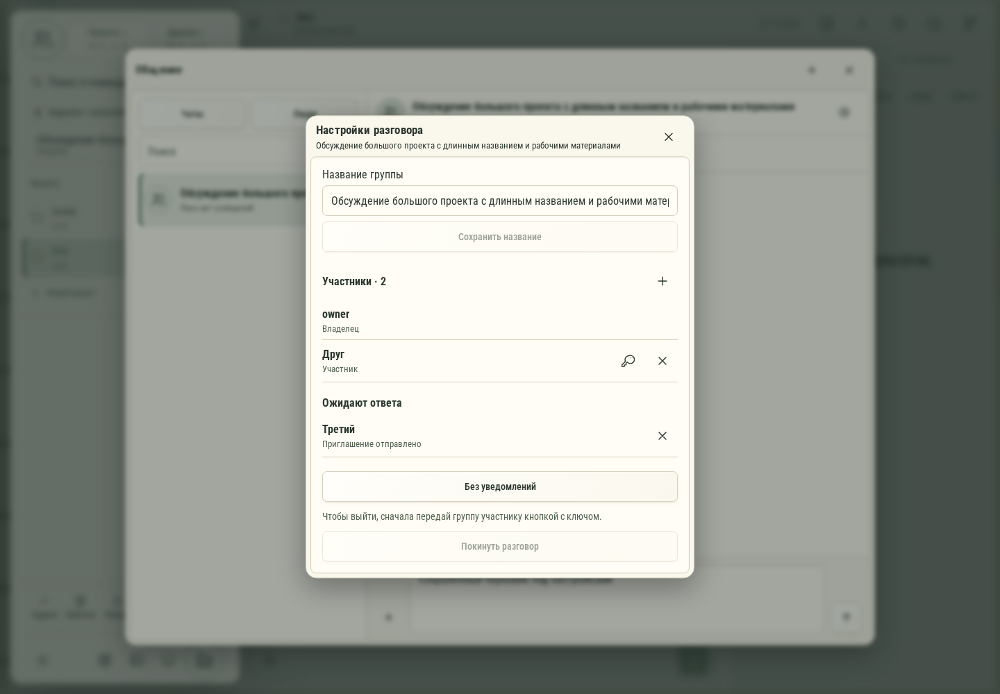

# 657. Настройки разговора

**Широкий экран · 1440 × 1000 · тема `organizer`.**

Название, состав и права участников личного/группового разговора.

**Как открыть:** Общение → настройки разговора.

**Снято после:** Отправить приглашение. Рабочее состояние.

Вложенное окно поверх сохранённого родительского экрана. Затемнение и видимые края родителя входят в снимок.

**Действия:** «Закрыть настройки разговора»; «Сохранить название»; «Пригласить участника»; «Передать группу: Друг»; «Удалить участника: Друг»; «Отозвать приглашение: Третий»; «Без уведомлений»; «Покинуть разговор».

**Поля и параметры:** «Название группы».

**Для обсуждения:** Понятно ли различие приглашения, участия и управления? Удобно ли работать с длинным списком людей?

Снимок фиксирует вид интерфейса. Данные демонстрационные; ошибки, ожидания и конфликты могли быть созданы сценарием. Это не подтверждение состояния рабочего сервера или реальных интеграций.

**Источник:** [ConversationMembers.tsx](../../apps/web/src/ConversationMembers.tsx). Сценарий `communication-members`; код `56214b0`, 2026-10-02. Chromium; размер окна эмулируется, это не физический iPhone.

[Другой размер](657-phone.md) · [Раздел](README.md) · [Весь каталог](../README.md)
