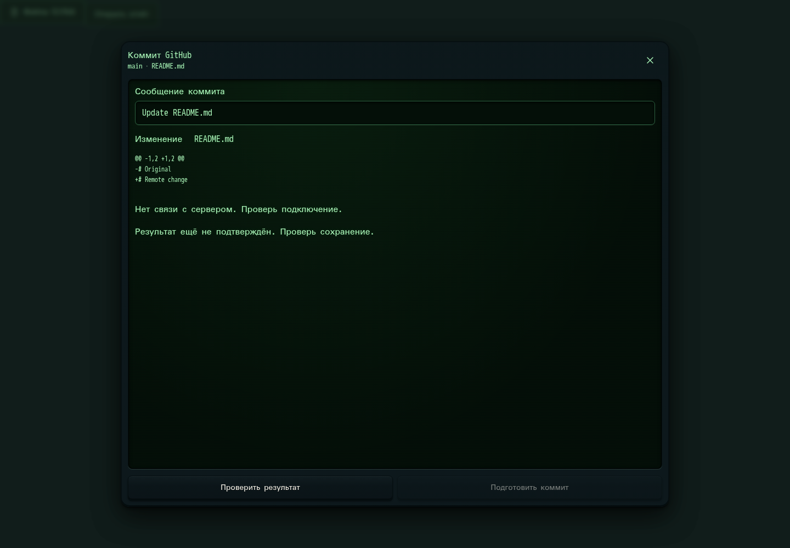

# 661. Коммит GitHub

**Широкий экран · 1440 × 1000 · тема `crt-green`.**

Проверка изменений файла перед созданием коммита GitHub.

**Как открыть:** Файлы GitHub → редактирование → просмотр изменений.

**Снято после:** Создать коммит. Сообщение об ошибке или проверке.

Вложенное окно поверх сохранённого родительского экрана. Затемнение и видимые края родителя входят в снимок.

Компонент открыт в изолированном стенде. Демонстрационный фон и кнопки запуска вне окна не являются отдельным экраном продукта.

**Действия:** «Закрыть коммит GitHub»; «Проверить результат»; «Подготовить коммит».

**Поля и параметры:** «Сообщение коммита».

**Для обсуждения:** Видны ли ветка, путь и точные изменения? Не смешаны ли сохранение черновика и публикация?

Снимок фиксирует вид интерфейса. Данные демонстрационные; ошибки, ожидания и конфликты могли быть созданы сценарием. Это не подтверждение состояния рабочего сервера или реальных интеграций.

**Источник:** [GitHubFiles.tsx](../../apps/web/src/GitHubFiles.tsx). Сценарий `manual-edit`; код `56214b0`, 2026-10-02. Chromium; размер окна эмулируется, это не физический iPhone.

[Другой размер](661-phone.md) · [Раздел](README.md) · [Весь каталог](../README.md)
