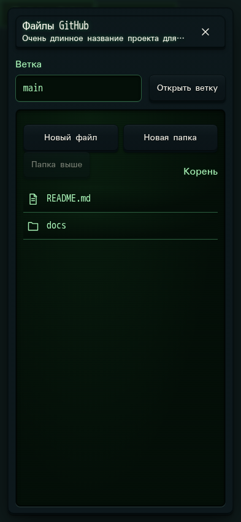

# 663. Файлы GitHub

**Телефон · 393 × 852 · тема `crt-green`.**

Ветки и файлы GitHub, просмотр и редактирование в веб-интерфейсе.

**Как открыть:** Проект/пространство → Файлы GitHub.

**Снято после:** Файлы GitHub. Рабочее состояние.

Компонент открыт в изолированном стенде. Демонстрационный фон и кнопки запуска вне окна не являются отдельным экраном продукта.

**Действия:** «Закрыть файлы GitHub»; «Открыть ветку»; «Новый файл»; «Новая папка»; «Папка выше»; «README.md»; «docs».

**Поля и параметры:** «Ветка GitHub».

**Для обсуждения:** Удобно ли перемещаться между ветками, деревом и редактором? Понятно ли, что это удалённые файлы?

Снимок фиксирует вид интерфейса. Данные демонстрационные; ошибки, ожидания и конфликты могли быть созданы сценарием. Это не подтверждение состояния рабочего сервера или реальных интеграций.

**Источник:** [GitHubFiles.tsx](../../apps/web/src/GitHubFiles.tsx). Сценарий `manual-edit`; код `56214b0`, 2026-10-02. Chromium; размер окна эмулируется, это не физический iPhone.

[Другой размер](663-desktop.md) · [Раздел](README.md) · [Весь каталог](../README.md)
