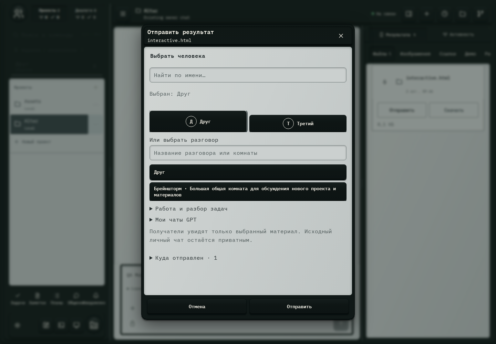

# 668. Отправить результат

**Широкий экран · 1440 × 1000 · тема `crt-green`.**

Передача результата в разговор/пространство либо открытие связанного источника.

**Как открыть:** Поделиться у результата; либо переход по ссылке GitHub в общении.

**Снято после:** Пользователи Hub. Рабочее состояние.

**Действия:** «Закрыть отправку»; «ДДруг»; «ТТретий»; «Друг»; «Брейншторм · Большая общая комната для обсуждения нового проекта и материалов»; «Отозвать»; «Отмена»; «Отправить».

**Поля и параметры:** «Найти человека»; «Название разговора или комнаты».

**Для обсуждения:** Понятны ли адресат, состав передаваемого материала и права доступа?

Снимок фиксирует вид интерфейса. Данные демонстрационные; ошибки, ожидания и конфликты могли быть созданы сценарием. Это не подтверждение состояния рабочего сервера или реальных интеграций.

**Источник:** [ResultSharing.tsx](../../apps/web/src/ResultSharing.tsx), [HumanReferences.tsx](../../apps/web/src/HumanReferences.tsx). Сценарий `communication`; код `56214b0`, 2026-10-02. Chromium; размер окна эмулируется, это не физический iPhone.

[Другой размер](668-phone.md) · [Раздел](README.md) · [Весь каталог](../README.md)
