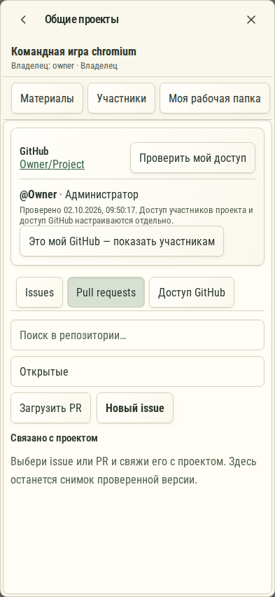

# 672. Общие проекты

**Телефон · 393 × 852 · тема `organizer`.**

Общие проекты, участники, доступ и подключение собственной рабочей копии.

**Как открыть:** Раздел общих проектов либо соответствующее действие пространства.

**Снято после:** Pull requests. Рабочее состояние.

**Действия:** «К совместным проектам»; «Закрыть совместные проекты»; «Материалы»; «Участники»; «Моя рабочая папка»; «Связи проектов»; «Консультации»; «Bridges»; «GitHub»; «История»; «Проверить мой доступ»; «Это мой GitHub — показать участникам»; «Issues»; «Pull requests»; дополнительные действия в прокручиваемой области.

**Поля и параметры:** «Поиск GitHub»; «Состояние GitHub».

**Для обсуждения:** Понятна ли связь общей карточки проекта и личной рабочей копии? Насколько ясно показаны роли?

Снимок фиксирует вид интерфейса. Данные демонстрационные; ошибки, ожидания и конфликты могли быть созданы сценарием. Это не подтверждение состояния рабочего сервера или реальных интеграций.

**Источник:** [TeamProjectsPanel.tsx](../../apps/web/src/TeamProjectsPanel.tsx). Сценарий `team-github`; код `56214b0`, 2026-10-02. Chromium; размер окна эмулируется, это не физический iPhone.

[Другой размер](672-desktop.md) · [Раздел](README.md) · [Весь каталог](../README.md)
