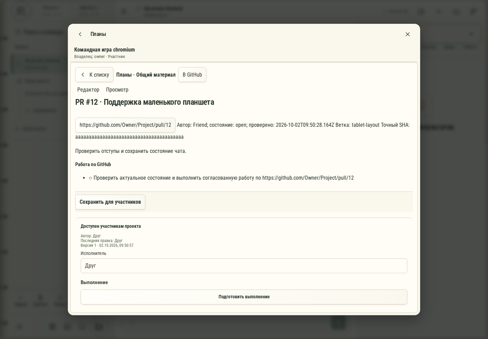

# 684. Планы

**Широкий экран · 1440 × 1000 · тема `organizer`.**

Общие проекты, участники, доступ и подключение собственной рабочей копии.

**Как открыть:** Раздел общих проектов либо соответствующее действие пространства.

**Снято после:** В мой план работы. Рабочее состояние.

Вложенное окно поверх сохранённого родительского экрана. Затемнение и видимые края родителя входят в снимок.

**Действия:** «К совместным проектам»; «Закрыть совместные проекты»; «К списку»; «В GitHub»; «Редактор»; «Просмотр»; «https://github.com/Owner/Project/pull/12»; «Сохранить для участников»; «Подготовить выполнение»; «Копировать материал»; «История версий»; «Удалить общий материал».

**Поля и параметры:** «ИсполнительНе назначенownerДруг».

**Для обсуждения:** Понятна ли связь общей карточки проекта и личной рабочей копии? Насколько ясно показаны роли?

Снимок фиксирует вид интерфейса. Данные демонстрационные; ошибки, ожидания и конфликты могли быть созданы сценарием. Это не подтверждение состояния рабочего сервера или реальных интеграций.

**Источник:** [TeamProjectsPanel.tsx](../../apps/web/src/TeamProjectsPanel.tsx). Сценарий `team-github`; код `56214b0`, 2026-10-02. Chromium; размер окна эмулируется, это не физический iPhone.

[Другой размер](684-phone.md) · [Раздел](README.md) · [Весь каталог](../README.md)
