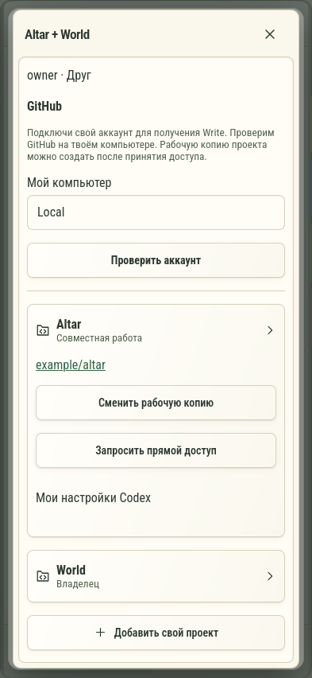

# 703. Общее пространство

**Телефон · 393 × 852 · тема `organizer`.**

Создание и управление пространством, участниками, проектами и общим чатом.

**Как открыть:** Переключатель Общие → пространство → действие.

**Снято после:** Открытое состояние. Рабочее состояние.

Вложенное окно поверх сохранённого родительского экрана. Затемнение и видимые края родителя входят в снимок.

**Действия:** «Закрыть пространство»; «Проверить аккаунт»; «Сменить рабочую копию»; «Запросить прямой доступ»; «Убрать из пространства»; «Добавить свой проект»; «Выйти из пространства».

**Поля и параметры:** «Компьютер для GitHub»; «Доступ: World · owner».

**Для обсуждения:** Ясно ли, какие материалы общие, а какие личные? Удобна ли иерархия пространства и проектов?

Снимок фиксирует вид интерфейса. Данные демонстрационные; ошибки, ожидания и конфликты могли быть созданы сценарием. Это не подтверждение состояния рабочего сервера или реальных интеграций.

**Источник:** [CollaborationSpaces.tsx](../../apps/web/src/CollaborationSpaces.tsx). Сценарий `collaboration-spaces`; код `56214b0`, 2026-10-02. Chromium; размер окна эмулируется, это не физический iPhone.

[Другой размер](703-desktop.md) · [Раздел](README.md) · [Весь каталог](../README.md)
