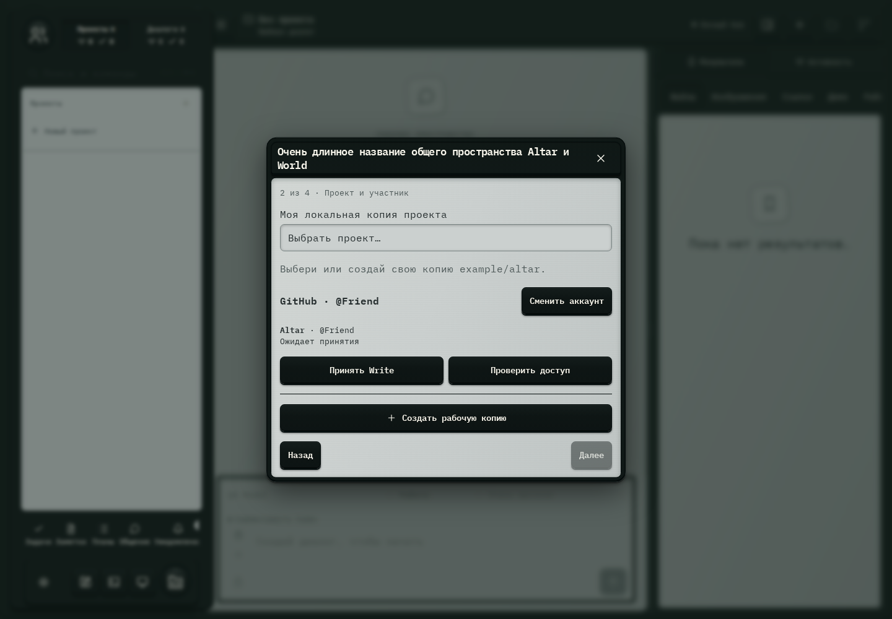

# 713. Общее пространство

**Широкий экран · 1440 × 1000 · тема `crt-green`.**

Создание и управление пространством, участниками, проектами и общим чатом.

**Как открыть:** Переключатель Общие → пространство → действие.

**Снято после:** Открытое состояние. Рабочее состояние.

Вложенное окно поверх сохранённого родительского экрана. Затемнение и видимые края родителя входят в снимок.

**Для обсуждения:** Ясно ли, какие материалы общие, а какие личные? Удобна ли иерархия пространства и проектов?

Снимок фиксирует вид интерфейса. Данные демонстрационные; ошибки, ожидания и конфликты могли быть созданы сценарием. Это не подтверждение состояния рабочего сервера или реальных интеграций.

**Источник:** [CollaborationSpaces.tsx](../../apps/web/src/CollaborationSpaces.tsx). Сценарий `member-bootstrap`; код `56214b0`, 2026-10-02. Chromium; размер окна эмулируется, это не физический iPhone.

[Другой размер](713-phone.md) · [Раздел](README.md) · [Весь каталог](../README.md)
