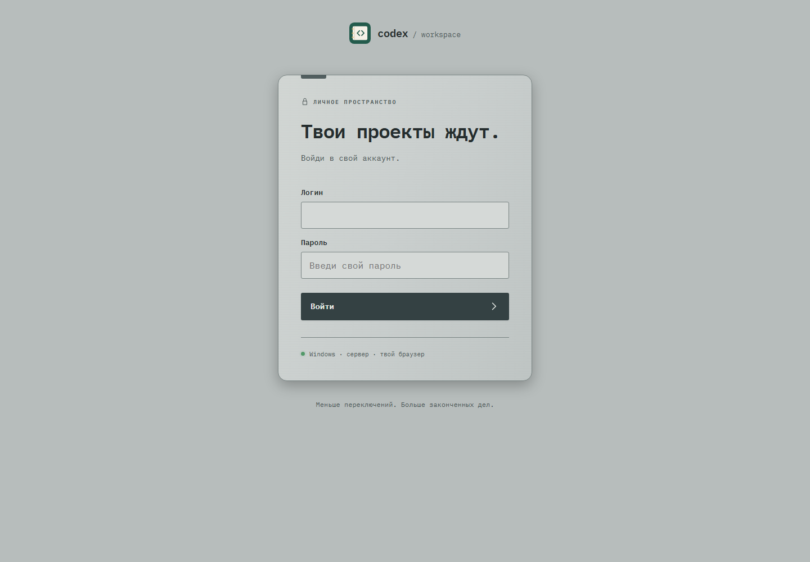

# 719. Твои проекты ждут.

**Широкий экран · 1440 × 1000 · тема `crt-green`.**

Вход, приглашение или управление доступом к рабочему пространству.

**Как открыть:** Стартовая страница / приглашение / Настройки → Доступ.

**Снято после:** Открытое состояние. Рабочее состояние.

**Действия:** «Войти».

**Поля и параметры:** «Логин»; «Введи свой пароль».

**Для обсуждения:** Ясны ли текущий аккаунт и следующий шаг? Какие объяснения нужны новому участнику?

Снимок фиксирует вид интерфейса. Данные демонстрационные; ошибки, ожидания и конфликты могли быть созданы сценарием. Это не подтверждение состояния рабочего сервера или реальных интеграций.

**Источник:** [TeamAccess.tsx](../../apps/web/src/TeamAccess.tsx), [Login.tsx](../../apps/web/src/Login.tsx). Сценарий `auth-startup`; код `56214b0`, 2026-10-02. Chromium; размер окна эмулируется, это не физический iPhone.

[Другой размер](719-phone.md) · [Раздел](README.md) · [Весь каталог](../README.md)
